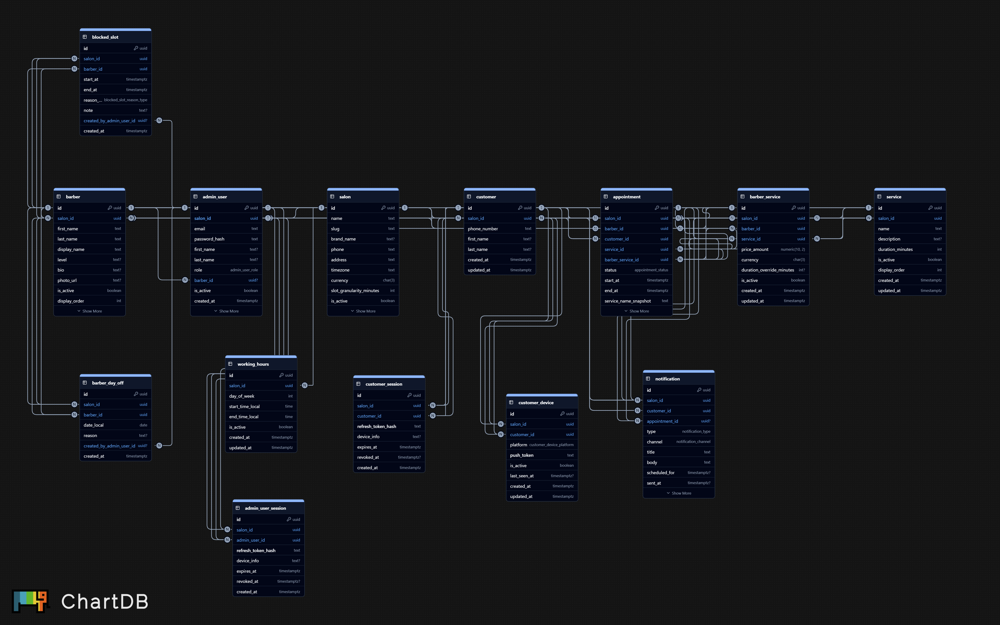
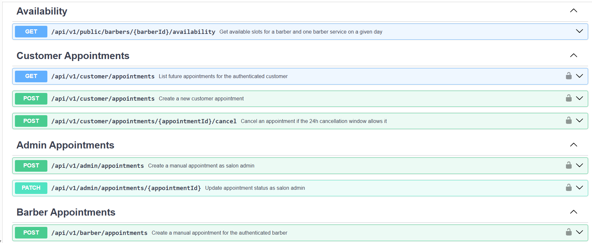

# Barber Booking Backend API

Backend API for a white-label barber booking platform built for real salon operations.

This repository is one part of a larger product suite:
- `backend` - NestJS API + booking engine
- `admin-web` - salon/admin dashboard
- `mobile-app` - customer-facing Flutter app

## Project Summary

This backend powers a barber booking SaaS workflow where:
- customers browse barbers, choose a service, and book a time slot
- salon admins manage schedules, appointments, services, pricing, and salon settings
- barbers can view their schedule, add manual bookings, and block unavailable time

The system is designed as a white-label MVP for a single salon deployment, while keeping the data model and architecture clean enough for future expansion.

## Core Features

- Customer login with development-friendly phone-based auth flow
- Staff login for `ADMIN` and `BARBER` roles
- Public barber list and barber detail endpoints
- Service-based availability engine
- Appointment creation, cancellation, manual booking, and status updates
- Day and week schedule endpoints for admin and barber views
- Working hours, day off, and blocked slot management
- Automatic `REQUIRES_RESCHEDULE` transition when availability conflicts are introduced
- Notification records for impacted appointments
- PostgreSQL persistence with overlap protection at database level

## Technical Highlights

- NestJS modular architecture
- PostgreSQL with transactional booking and scheduling flows
- Slot-based schedule model with configurable slot granularity
- White-label salon context via environment configuration
- DTO validation with strict request whitelisting
- E2E-tested booking, auth, and schedule flows

## Architecture

Main modules:
- `auth`
- `availability`
- `appointments`
- `schedule`
- `management`

Supporting layers:
- shared request-context guards/decorators
- HMAC token service for access/refresh sessions
- PostgreSQL repository layer via `pg`

## Tech Stack

- NestJS
- TypeScript
- PostgreSQL
- `pg`
- class-validator / class-transformer
- Jest (E2E)

## API Capabilities

Examples of implemented API areas:
- `POST /api/v1/auth/customer/login`
- `POST /api/v1/auth/staff/login`
- `GET /api/v1/public/barbers`
- `GET /api/v1/public/barbers/:barberId`
- `GET /api/v1/public/barbers/:barberId/availability`
- `POST /api/v1/customer/appointments`
- `GET /api/v1/customer/appointments/future`
- `GET /api/v1/admin/appointments`
- `GET /api/v1/admin/schedule/day`
- `GET /api/v1/admin/schedule/week`
- `POST /api/v1/admin/barbers/:barberId/day-off`
- `POST /api/v1/admin/barbers/:barberId/blocked-slots`
- `PUT /api/v1/admin/settings/salon`
- `PUT /api/v1/admin/settings/working-hours`

## Local Development

### Requirements

- Node.js 20+
- PostgreSQL
- npm

### Environment Variables

Create `.env` from `.env.example`.

Required values:
- `DATABASE_URL` or `DB_HOST`, `DB_PORT`, `DB_NAME`, `DB_USER`, `DB_PASSWORD`
- `APP_SALON_ID`
- `AUTH_ACCESS_TOKEN_SECRET`
- `AUTH_REFRESH_TOKEN_SECRET`

Optional:
- `DB_POOL_MAX`
- `PORT`

### Run Locally

```bash
npm install
npm run start:dev
```

### Test and Build

```bash
npm run build
npm run test:e2e
npm run lint
```

## Demo Credentials

After migrations and seed:

- `admin@downtownbarber.rs` / `Admin123!`
- `nikola@downtownbarber.rs` / `Barber123!`

## Deployment Notes

This backend was prepared for simple cloud deployment:
- supports hosted PostgreSQL through `DATABASE_URL`
- supports platform-defined `PORT`
- works well with Render or Railway style Node hosting

Current demo deployment stack:
- backend API deployed on `Render`
- PostgreSQL database hosted on `Supabase`
- designed to work together with the `admin-web` app deployed on `Vercel`

This setup was used to demonstrate a realistic hosted MVP environment instead of a localhost-only prototype.

## Screenshots / Diagrams

Current backend visuals:




## What This Project Demonstrates

This repository is strong portfolio material for:
- backend API design
- scheduling and booking logic
- time-slot availability calculation
- transactional PostgreSQL workflows
- role-based access control
- white-label SaaS backend thinking

## Related Repositories

This backend is intended to be presented together with:
- the salon admin dashboard repository
- the customer mobile app repository
